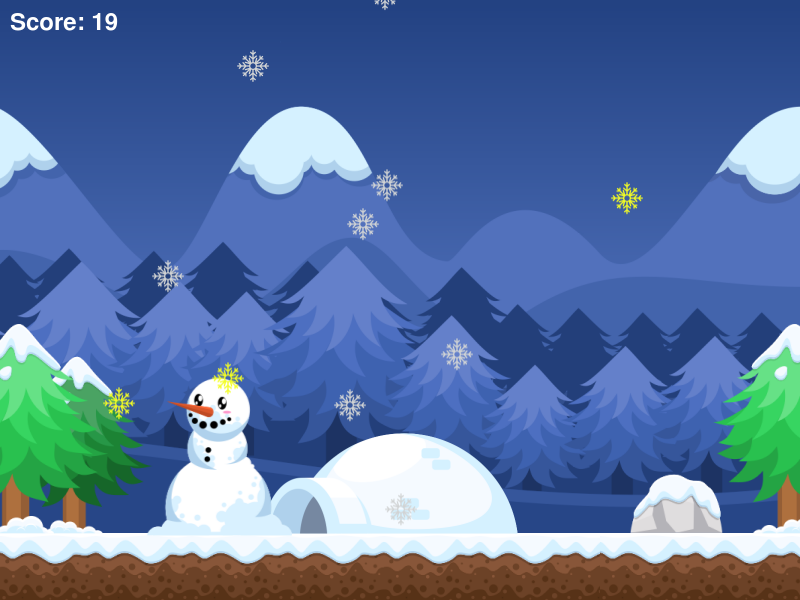

# Yellow Snow - Neural Network (C - SDL2)
Earn points by collecting all the tasty white snow flakes that fall. But watch out for the yellow snow. The Neural Network can be loaded from a file if it exist, or a new random network will be created.When training finishes it will save the current top networks back into the neural-networks file. If ai_on is enabled the game will play but the neural-network will have the ablility to move the snowman. If ai_train is on the game will play without delay, with as many FPS as possible. If gfx_off is enabled then the game will not load a graphical window, or load SDL at all. It will play the game but you will not see it happening. This is much, much faster. If threads are used it will complete generations of training even faster. I was able to have it play 20 million games in 2.5 hours, using 16 threads on a laptop.

# Build
To build the yellow-snow binary you will need all required build tools needed to compile via Makefile and gcc. You will also need SDL2 with image, ttf and mixer both the libraries and headerfiles.

ArchLinux instructions.
```
sudo pacman -S --needed base-devel
sudo pacman -S --needed sdl2 sdl2_image sdl2_mixer sdl2_ttf
./yellow-snow
```
Command line switches. Some switches will turn others on or off. `--ai_train` will enable `--ai_on` and if `--threads` are set then so is `--gfx_off`.
```
--ai_on
--ai_train
--gfx_off
--threads {num}
--generations {num}
```

# Controls
Left Arrow - Moves left.\
Right Arrow - Moves right.\
Space Bar - Resets the Game.\
Escape - Quits and closes game. \
F - Prints FPS to the console.

